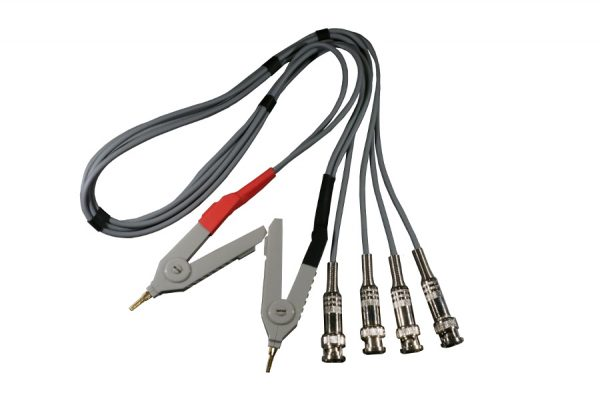

Ultra-Precision 32-bit Digital Milliohm Meter

Overview

This project features a high-performance, professional-grade digital milliohm meter designed for ultra-low resistance measurements. Built around the STM32F407 microcontroller and the ADS1262 32-bit Delta-Sigma ADC, the instrument is capable of resolving resistances in the micro-ohm (μΩ) range with extreme stability and accuracy.

The device is ideal for measuring PCB trace resistance, transformer windings, motor coils, and battery internal resistance (ESR).
Key Features

    Measurement Core: TI ADS1262 32-bit ADC providing up to 38kSPS and integrated PGA for high-gain low-noise amplification.

    Processing Power: STM32F407VET6 running at 168MHz for real-time data processing and Auto-Range logic.

    Isolated Power Architecture:

        Rail A: Dedicated AP63203 Buck converter for the OLED display to eliminate switching noise from the measurement path.

        Rail B: High-precision TPS62133 + MIC5219 LDO for the ADC and analog front-end.

    Display: Large 3.12" 256x64 OLED (SSD1322) via 4-wire SPI for clear data visualization and graphing.

    Smart Auto-Range: Fully automatic gain adjustment (1x to 64x) to handle measurements from μΩ up to several Ω without manual intervention.

    Power System: Integrated NiMH battery management via MAX713, supporting both battery and external DC power.

    Connectivity:

        USB-C for data logging (VCP) and firmware updates.

        JTAG/SWD 20-pin header for professional debugging.

        Expansion Headers: 30-pin (15+15) header for future add-ons like an AD9850 DDS signal generator.

       HTML:
